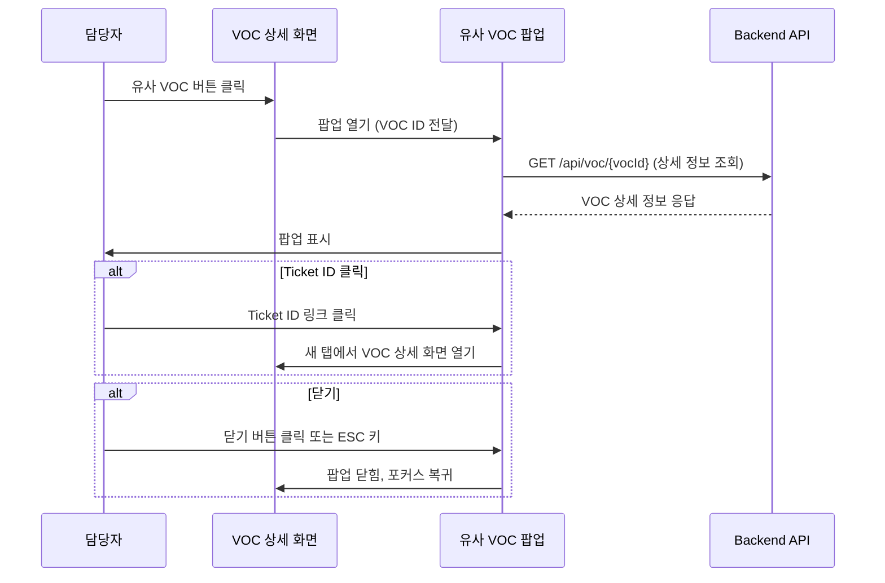

# SC-07: 유사 VOC 팝업 화면

## 1. 화면 개요

### 1.1 화면 정의
- **화면 ID**: SC-07
- **화면명**: 유사 VOC 팝업
- **화면 유형**: Modal/Popup
- **연관 이슈**: [#7](https://github.com/your-repo/issues/7)

### 1.2 목적
VOC 처리 담당자가 VOC 상세 화면(SC-06)에서 유사 VOC 버튼을 클릭했을 때, 과거 유사 VOC의 전체 정보를 팝업으로 표시하여 참고할 수 있도록 지원합니다.

### 1.3 주요 기능
- 유사 VOC의 상세 정보 조회
- 해당 VOC의 처리 결과 및 응대 내용 확인
- 유사 VOC를 참고하여 현재 VOC 처리 시 활용

---

## 2. 접근 권한

| 사용자 유형 | 접근 권한 | 비고 |
|------------|----------|------|
| VOC 처리 담당자 | O | VOC 상세 화면에서 유사 VOC 버튼 클릭 시 |
| VOC 접수자 | X | 접근 불가 |
| 관리자 | O | VOC 상세 화면 접근 가능 시 |

---

## 3. 레이아웃 구조

### 3.1 모달/팝업 스펙
```
┌─────────────────────────────────────────────────────┐
│  유사 VOC 상세                                [닫기] │
├─────────────────────────────────────────────────────┤
│                                                     │
│  [VOC 기본 정보 영역]                                │
│  - Ticket ID, 접수일시, 상태                         │
│  - 최종 사용자 이메일                                │
│  - 카테고리                                         │
│  - 유사도 표시                                      │
│                                                     │
│  [VOC 내용 영역]                                    │
│  - 제목                                            │
│  - 내용                                            │
│  - 첨부파일 (있는 경우)                             │
│                                                     │
│  [처리 결과 영역]                                   │
│  - 처리 담당자                                      │
│  - 처리 완료일                                      │
│  - 처리 내용/응대 가이드                            │
│  - 담당자 메모/코멘트                               │
│                                                     │
│  [이력 영역] (선택사항)                             │
│  - 상태 변경 이력                                   │
│  - 카테고리 수정 이력                               │
│                                                     │
└─────────────────────────────────────────────────────┘
```

### 3.2 모달 속성
| 속성 | 값 | 비고 |
|------|-----|------|
| 크기 | Large (최소 800px x 600px) | 콘텐츠에 따라 가변 |
| 배경 Dimmed | O | 모달 외부 영역 어둡게 처리 |
| 외부 클릭 닫기 | X | 명시적 닫기 버튼만 사용 |
| ESC 키 닫기 | O | 키보드 접근성 지원 |
| 스크롤 | 내부 스크롤 | 콘텐츠가 많을 경우 모달 내부 스크롤 |

---

## 4. UI 요소 목록

### 4.1 헤더 영역

| UI 요소 | 유형 | 설명 | 필수 여부 |
|---------|------|------|----------|
| 제목 | Text | "유사 VOC 상세" 고정 텍스트 | 필수 |
| 닫기 버튼 | Button | 모달 닫기 (X 아이콘) | 필수 |

### 4.2 VOC 기본 정보 영역

| UI 요소 | 유형 | 설명 | 필수 여부 |
|---------|------|------|----------|
| Ticket ID | Text (Link) | 클릭 시 해당 VOC 상세 화면으로 새 탭 열기 | 필수 |
| 유사도 | Badge/Chip | 현재 VOC와의 유사도 (0.70 ~ 1.00) | 필수 |
| 접수일시 | Text | YYYY-MM-DD HH:mm:ss 형식 | 필수 |
| 상태 | Badge | 완료/반려 등 상태 표시 (색상 구분) | 필수 |
| 최종 사용자 이메일 | Text | 마스킹 처리 (예: u***@example.com) | 필수 |
| 카테고리 | Badge/Chip | 대분류 > 중분류 형식 | 필수 |

### 4.3 VOC 내용 영역

| UI 요소 | 유형 | 설명 | 필수 여부 |
|---------|------|------|----------|
| 제목 | Text | VOC 제목 | 필수 |
| 내용 | Textarea (읽기 전용) | VOC 상세 내용 | 필수 |
| 첨부파일 목록 | List (Link) | 첨부파일 다운로드 링크 | 선택 |

### 4.4 처리 결과 영역

| UI 요소 | 유형 | 설명 | 필수 여부 |
|---------|------|------|----------|
| 처리 담당자 | Text | 담당자 이름 또는 ID | 필수 |
| 처리 완료일 | Text | YYYY-MM-DD HH:mm:ss 형식 | 필수 (완료 상태일 경우) |
| 처리 내용/응대 가이드 | Textarea (읽기 전용) | 담당자가 작성한 처리 내용 | 필수 |
| 담당자 메모/코멘트 | Textarea (읽기 전용) | 내부 메모 (FR-708) | 선택 |
| 반려 사유 | Textarea (읽기 전용) | 반려 상태일 경우 표시 (FR-802) | 조건부 필수 |

### 4.5 이력 영역 (선택사항)

| UI 요소 | 유형 | 설명 | 필수 여부 |
|---------|------|------|----------|
| 상태 변경 이력 | Timeline/Table | 상태 변경 내역 (변경자, 시간, 이전/이후 상태) | 선택 |
| 카테고리 수정 이력 | Timeline/Table | 카테고리 수정 내역 (FR-1002) | 선택 |

### 4.6 푸터 영역

| UI 요소 | 유형 | 설명 | 필수 여부 |
|---------|------|------|----------|
| 닫기 버튼 | Button | 모달 닫기 (Primary 또는 Secondary) | 필수 |

---

## 5. 사용자 액션/이벤트

### 5.1 진입 경로
```
VOC 상세 화면(SC-06) → [유사 VOC 버튼 클릭] → 유사 VOC 팝업(SC-07) 열림
```

### 5.2 주요 액션

| 액션 | 설명 | 결과 |
|------|------|------|
| 유사 VOC 버튼 클릭 | SC-06에서 유사 VOC ID 버튼 클릭 (FR-704) | 팝업 열림 + API 호출하여 상세 정보 로드 |
| Ticket ID 클릭 | 팝업 내 Ticket ID 링크 클릭 | 새 탭에서 해당 VOC 상세 화면(SC-06) 열림 |
| 첨부파일 다운로드 | 첨부파일 링크 클릭 | 파일 다운로드 |
| 닫기 버튼 클릭 | 헤더 또는 푸터 닫기 버튼 클릭 | 팝업 닫힘, SC-06으로 복귀 |
| ESC 키 입력 | 키보드 ESC 키 입력 | 팝업 닫힘, SC-06으로 복귀 |

### 5.3 이벤트 흐름



---

## 6. 연관 API

### 6.1 유사 VOC 상세 조회

**Endpoint**: `GET /api/voc/{vocId}`

**Request Parameters**:
| 파라미터 | 타입 | 필수 | 설명 |
|---------|------|------|------|
| vocId | String (Path) | O | 조회할 VOC의 Ticket ID |

**Response**:
```json
{
  "ticketId": "VOC-20260123-00001",
  "similarity": 0.85,
  "status": "completed",
  "category": {
    "main": "오류/버그",
    "sub": "시스템 오류"
  },
  "createdAt": "2026-01-15T10:30:00Z",
  "completedAt": "2026-01-16T14:20:00Z",
  "endUserEmail": "u***@example.com",
  "title": "로그인 시 에러 발생",
  "content": "로그인 버튼 클릭 시 500 에러가 발생합니다...",
  "attachments": [
    {
      "id": "file-001",
      "name": "error-screenshot.png",
      "size": 1048576,
      "downloadUrl": "/api/files/file-001"
    }
  ],
  "resolution": {
    "assignee": "홍길동",
    "content": "외부 연동 시스템 장애로 인한 일시적 오류였습니다. 재시도 로직을 추가하여 개선했습니다.",
    "memo": "내부 메모: OAuth 서버 응답 지연 문제"
  },
  "auditLogs": [
    {
      "timestamp": "2026-01-15T10:30:00Z",
      "action": "status_change",
      "user": "시스템",
      "from": "접수",
      "to": "분석중"
    },
    {
      "timestamp": "2026-01-15T11:00:00Z",
      "action": "status_change",
      "user": "시스템",
      "from": "분석중",
      "to": "처리중"
    },
    {
      "timestamp": "2026-01-16T14:20:00Z",
      "action": "status_change",
      "user": "홍길동",
      "from": "처리중",
      "to": "완료"
    }
  ]
}
```

**Error Responses**:
| 상태 코드 | 설명 |
|----------|------|
| 404 | VOC를 찾을 수 없음 |
| 403 | 접근 권한 없음 |
| 500 | 서버 에러 |

### 6.2 첨부파일 다운로드

**Endpoint**: `GET /api/files/{fileId}`

**Request Parameters**:
| 파라미터 | 타입 | 필수 | 설명 |
|---------|------|------|------|
| fileId | String (Path) | O | 다운로드할 파일 ID |

**Response**: Binary file stream

---

## 7. 화면 전환

### 7.1 진입
| From | Trigger | To |
|------|---------|-----|
| SC-06 (VOC 상세) | 유사 VOC 버튼 클릭 | SC-07 (유사 VOC 팝업) 열림 |

### 7.2 이탈
| From | Trigger | To |
|------|---------|-----|
| SC-07 (유사 VOC 팝업) | 닫기 버튼 클릭 | SC-06 (VOC 상세) 복귀 (포커스 유지) |
| SC-07 (유사 VOC 팝업) | ESC 키 입력 | SC-06 (VOC 상세) 복귀 (포커스 유지) |
| SC-07 (유사 VOC 팝업) | Ticket ID 클릭 | SC-06 (새 탭) + SC-07 유지 |

### 7.3 화면 전환 다이어그램

```
┌─────────────┐
│   SC-06     │
│ VOC 상세    │
└──────┬──────┘
       │ 유사 VOC 버튼 클릭
       ▼
┌─────────────┐
│   SC-07     │
│ 유사 VOC    │◄───── 팝업 (모달 형태)
│   팝업      │
└──────┬──────┘
       │ 닫기/ESC
       ▼
┌─────────────┐
│   SC-06     │
│ VOC 상세    │◄───── 포커스 복귀
└─────────────┘
```

---

## 8. 데이터 구조

### 8.1 유사 VOC 표시 정보 (from SC-06)

SC-06에서 전달받는 유사 VOC 정보:
```typescript
interface SimilarVOC {
  vocId: string;         // Ticket ID
  similarity: number;    // 유사도 (0.70 ~ 1.00)
  title: string;         // VOC 제목 (미리보기용)
  status: string;        // 상태 (완료/반려 등)
}
```

### 8.2 팝업에서 로드하는 상세 정보

```typescript
interface VOCDetail {
  ticketId: string;
  similarity: number;
  status: 'completed' | 'rejected' | 'in_progress' | 'pending' | 'analyzing' | 'analysis_failed';
  category: {
    main: string;
    sub: string;
  };
  createdAt: string;
  completedAt?: string;
  endUserEmail: string;   // 마스킹 처리됨
  title: string;
  content: string;
  attachments?: Attachment[];
  resolution: {
    assignee: string;
    content: string;      // 처리 내용/응대 가이드
    memo?: string;        // 담당자 메모
    rejectionReason?: string;  // 반려 사유 (반려 시)
  };
  auditLogs?: AuditLog[];
}

interface Attachment {
  id: string;
  name: string;
  size: number;
  downloadUrl: string;
}

interface AuditLog {
  timestamp: string;
  action: 'status_change' | 'category_change';
  user: string;
  from?: string;
  to?: string;
}
```

---

## 9. 예외 처리

### 9.1 에러 시나리오

| 시나리오 | 처리 방법 |
|---------|----------|
| VOC ID가 존재하지 않음 (404) | 팝업 내에 "해당 VOC를 찾을 수 없습니다" 메시지 표시 |
| 접근 권한 없음 (403) | 팝업 내에 "접근 권한이 없습니다" 메시지 표시 |
| 네트워크 에러 | 팝업 내에 "일시적인 오류가 발생했습니다. 다시 시도해 주세요" 메시지 표시 + 재시도 버튼 |
| 서버 에러 (500) | 팝업 내에 "서버 오류가 발생했습니다. 잠시 후 다시 시도해 주세요" 메시지 표시 |

### 9.2 로딩 상태

| 상태 | UI 표시 |
|------|---------|
| 데이터 로딩 중 | Spinner/Skeleton UI 표시 |
| 로딩 완료 | 전체 콘텐츠 표시 |
| 로딩 실패 | 에러 메시지 + 재시도 버튼 |

---

## 10. 접근성 (Accessibility)

### 10.1 키보드 접근성

| 키 | 동작 |
|-----|------|
| ESC | 팝업 닫기 |
| Tab | 팝업 내 포커스 이동 (순환) |
| Enter | 링크/버튼 활성화 |

### 10.2 ARIA 속성

| 요소 | ARIA 속성 |
|------|----------|
| Modal | `role="dialog"`, `aria-modal="true"`, `aria-labelledby="modal-title"` |
| 닫기 버튼 | `aria-label="팝업 닫기"` |
| Ticket ID 링크 | `aria-label="새 탭에서 VOC {ticketId} 상세 보기"` |

### 10.3 포커스 관리

- 팝업 열릴 때: 첫 번째 포커스 가능한 요소(닫기 버튼)로 포커스 이동
- 팝업 닫힐 때: 원래 트리거 버튼(유사 VOC 버튼)으로 포커스 복귀
- 팝업 열려 있을 때: 포커스를 팝업 내부로 제한 (Focus Trap)

---

## 11. 디자인 가이드

### 11.1 색상 체계

| 요소 | 색상 | 용도 |
|------|------|------|
| 유사도 뱃지 (높음) | Green | 0.85 ~ 1.00 |
| 유사도 뱃지 (중간) | Yellow | 0.75 ~ 0.84 |
| 유사도 뱃지 (낮음) | Orange | 0.70 ~ 0.74 |
| 상태 뱃지 (완료) | Blue | Completed |
| 상태 뱃지 (반려) | Red | Rejected |
| 상태 뱃지 (처리중) | Gray | In Progress |

### 11.2 타이포그래피

| 요소 | 폰트 크기 | 폰트 굵기 |
|------|----------|----------|
| 제목 (헤더) | 18px | Bold |
| Ticket ID | 16px | Medium |
| 섹션 제목 | 14px | Bold |
| 본문 | 14px | Regular |
| 메타 정보 | 12px | Regular |

### 11.3 간격

| 요소 | 간격 |
|------|------|
| 섹션 간 | 24px |
| 필드 간 | 12px |
| 패딩 (모달) | 24px |

---

## 12. 비기능 요구사항

### 12.1 성능

| 항목 | 기준 |
|------|------|
| 팝업 오픈 시간 | 300ms 이내 (애니메이션 포함) |
| API 응답 시간 | 1초 이내 |
| 첨부파일 다운로드 시작 | 즉시 (응답 시작) |

### 12.2 보안

| 항목 | 요구사항 |
|------|----------|
| 이메일 마스킹 | 최종 사용자 이메일 마스킹 처리 (u***@example.com) |
| 권한 검증 | API 레벨에서 접근 권한 검증 |
| XSS 방지 | 모든 텍스트 출력 시 sanitization |

### 12.3 사용성

| 항목 | 요구사항 |
|------|----------|
| 반응형 | 최소 800px 이상 화면에서 정상 작동 |
| 브라우저 호환성 | Chrome, Firefox, Safari, Edge 최신 2개 버전 |
| 키보드 네비게이션 | 모든 기능을 키보드로 접근 가능 |

---

## 13. 테스트 시나리오

### 13.1 기능 테스트

| 테스트 케이스 | 입력 | 예상 결과 |
|-------------|------|----------|
| 유사 VOC 팝업 열기 | SC-06에서 유사 VOC 버튼 클릭 | 팝업 열림 + API 호출 + 데이터 표시 |
| Ticket ID 클릭 | 팝업 내 Ticket ID 링크 클릭 | 새 탭에서 VOC 상세 화면 열림 |
| 첨부파일 다운로드 | 첨부파일 링크 클릭 | 파일 다운로드 시작 |
| 팝업 닫기 (버튼) | 닫기 버튼 클릭 | 팝업 닫힘 + 포커스 복귀 |
| 팝업 닫기 (ESC) | ESC 키 입력 | 팝업 닫힘 + 포커스 복귀 |

### 13.2 에러 처리 테스트

| 테스트 케이스 | 입력 | 예상 결과 |
|-------------|------|----------|
| 존재하지 않는 VOC | 잘못된 VOC ID | 404 에러 메시지 표시 |
| 권한 없음 | 권한 없는 VOC 접근 | 403 에러 메시지 표시 |
| 네트워크 에러 | 네트워크 차단 | 에러 메시지 + 재시도 버튼 |

### 13.3 접근성 테스트

| 테스트 케이스 | 입력 | 예상 결과 |
|-------------|------|----------|
| 키보드 네비게이션 | Tab 키로 이동 | 모든 인터랙티브 요소 포커스 가능 |
| 스크린 리더 | NVDA/JAWS로 탐색 | 모든 콘텐츠 읽기 가능 |
| 포커스 트랩 | Tab 키로 순환 | 팝업 내부에서만 포커스 이동 |

---

## 14. 구현 우선순위

### 14.1 Phase 1 (필수)
- [ ] 모달 팝업 컴포넌트 구현
- [ ] VOC 기본 정보 표시
- [ ] VOC 내용 표시
- [ ] 처리 결과 표시
- [ ] 닫기 기능
- [ ] API 연동
- [ ] 로딩/에러 처리

### 14.2 Phase 2 (선택)
- [ ] 첨부파일 다운로드
- [ ] Ticket ID 클릭 시 새 탭 열기
- [ ] 담당자 메모 표시
- [ ] 이력 영역 표시
- [ ] 키보드 접근성 강화

### 14.3 Phase 3 (개선)
- [ ] 애니메이션 효과
- [ ] 반응형 레이아웃
- [ ] 인쇄 기능
- [ ] 공유 기능

---

## 15. 참고 자료

### 15.1 관련 요구사항
- FR-302: 유사 VOC 검색 (유사도 0.7 이상, 최대 5건)
- FR-703: 유사 VOC가 있을 경우 VOC ID 버튼 표시
- FR-704: 유사 VOC 버튼 클릭 시 팝업 표시
- FR-708: 담당자 메모/코멘트 입력
- FR-802: 반려 시 반려 사유 필수 입력
- FR-1001: VOC 상태 변경 이력 저장
- FR-1002: 카테고리 수정 이력 저장
- FR-1003: VOC 상세 화면에서 변경 이력 조회

### 15.2 관련 화면
- SC-06: VOC 상세 화면 (부모 화면)

### 15.3 기술 스택 (예상)
- React 18+
- TypeScript 5+
- TanStack Query (데이터 페칭)
- Headless UI / Radix UI (모달 컴포넌트)
- Tailwind CSS (스타일링)

---

## 16. 변경 이력

| 버전 | 날짜 | 작성자 | 변경 내용 |
|------|------|--------|----------|
| 1.0.0 | 2026-01-23 | Claude Code | 초안 작성 |
